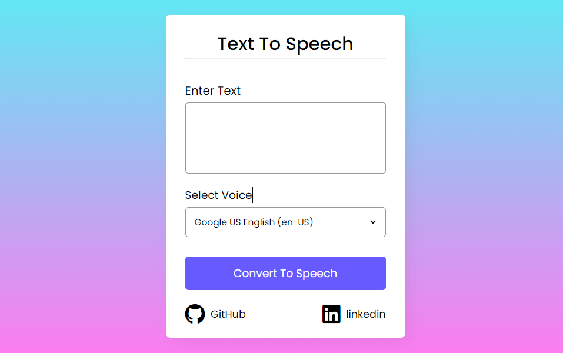

# Text-to-Speech-Converter-using-HTML-CSS-and-JavaScript

##Demo
#Text-to-Speech-Converter

##Description
Developed a web-based Text-to-Speech application utilizing JavaScript's Web Speech API, offering users the ability to convert text into speech. Integrated Google Fonts for typography enhancement and ensured responsiveness to media queries. Key features include voice selection, pause/resume functionality, and a modern user interface.

## Installation

As the ## Installation

As the ## Installation

As the Text-to-Speech-Converter is a client-side application, you can use it directly without any installation. However, if you want to host it locally, follow these steps:

1. Clone this repository to your local machine:

bash git
https://github.com/ankitab78/Text-To-Speech-Convertor.git

2. Navigate to the project directory:

bash
cd Text-to-Speech-Converter

3. Open index.html in your web browser.

## Usage

1. Open the Text-to-Speech-Converter in your web browser by accessing the [live demo](https://ankitab78.github.io/Text-To-Speech-Convertor/) or hosting it locally as described in the Installation section.

2. Enter the text for which you want to speech from a Text-to-Speech-Converter in the input field.

3. The Text-to-Speech-Converter will be generated in real-time below the input field.

## Contributing

Contributions to the QR Code Generator project are welcome! If you find any issues or have suggestions for improvement, please feel free to open an issue or create a pull request on the [GitHub repository](https://github.com/ankitab78/Text-To-Speech-Convertor.git).

---
Enjoy using the Text-to-Speech-Converter! If you have any questions or need further assistance, feel free to reach out to the project's author or the community. Happy Text-to-Speech-Converter!

## 🔗 Links
is a client-side application, you can use it directly without any installation.

